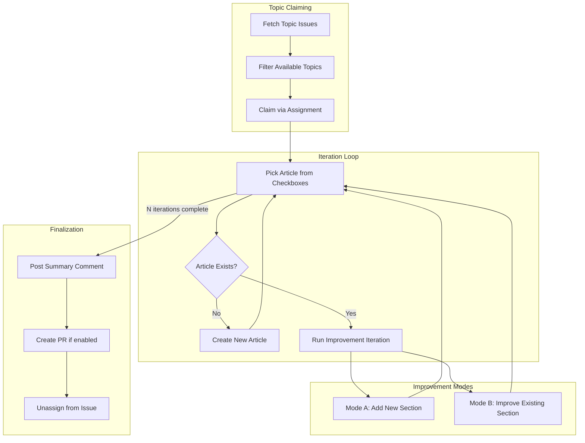
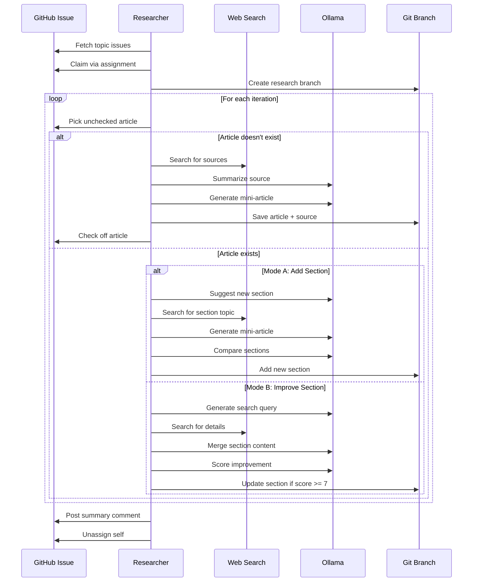

# Gitopedia Researcher

The Researcher is an AI-powered agent that automatically creates and improves encyclopedia articles for Gitopedia using an **iterative improvement model**. It monitors GitHub issues for research topics, gathers information from web sources, and generates well-sourced, comprehensive Markdown articles.

## Iterative Improvement Architecture

The researcher uses a topic-based iteration model that creates articles and continuously improves them through multiple passes:



## How It Works

### 1. Topic Claiming
- Fetches all open issues with "Research Topic" issue type
- Filters to unassigned topics without pending PRs
- Claims a topic by assigning itself to the issue
- Creates a research branch for all work

### 2. Article Creation
- Picks unchecked articles from topic issue checkboxes
- Searches the web for relevant sources (filters encyclopedias)
- Summarizes source content via LLM
- Generates initial "mini-article" from the summary
- Saves source summaries to `_incoming/sources/`

### 3. Article Improvement (Two Modes)
Each iteration randomly selects one of two improvement modes:

**Mode A: Add New Section**
- LLM suggests a missing section based on topic context
- Searches for sources specific to the suggested section
- Generates a mini-article from the new source
- Extracts and adds valuable new sections to the existing article

**Mode B: Improve Existing Section**
- Selects an existing section (weighted toward shorter sections)
- LLM generates a contextual search query
- Finds new source with additional details
- Merges new information into the existing section
- Scores the improvement; accepts only if score ≥ 7/10

### 4. Finalization
- Posts a summary comment to the issue with all changes
- Optionally creates a PR (if `CREATE_PR_AFTER_ITERATIONS=true`)
- Unassigns itself from the issue

## Multi-Model Configuration

Different models are used for different task complexities:

| Task | Model | Thinking Mode |
|------|-------|---------------|
| Topic Suggestion | qwen3:8b | No |
| JSON Conversion | qwen3:8b | No |
| Section Extraction | qwen3:8b | No |
| Encyclopedia Check | qwen3:8b | No |
| Source Summarization | deepseek-r1:14b | No (long output) |
| Entity Extraction | deepseek-r1:14b | No |
| Article Generation | deepseek-r1:14b | Yes |
| Section Comparison | deepseek-r1:14b | Yes |
| Section Merging | deepseek-r1:14b | Yes |

## Prerequisites

### GitHub CLI

```bash
gh auth login
gh auth status
```

### Ollama

```bash
# Fast model (topic suggestion, JSON tasks)
ollama pull qwen3:8b

# Article model (generation, summarization)
ollama pull deepseek-r1:14b

# Embedding model (for knowledge-base, optional)
ollama pull nomic-embed-text
```

## Configuration

Configuration is loaded from `config/base.env` with optional overrides in `config/.env`.

### Key Settings

```bash
# Run profile
RUN_PROFILE=prod             # prod or test

# Multi-model configuration
LLM_MODEL_FAST=qwen3:8b          # Fast tasks
LLM_MODEL_ARTICLE=deepseek-r1:14b # Article generation

# LLM Thinking Mode
LLM_THINK_MODE=true

# Topic Processing
TOPIC_PROCESSING_ITERATIONS=10       # Iterations per claimed topic
IMPROVEMENTS_PER_NEW_ARTICLE=10      # Improvement passes after creating article
CREATE_PR_AFTER_ITERATIONS=false     # Create PR when done (or just commit to branch)
AUTO_MERGE_READY_PRS=false           # Auto-merge approved PRs

# Search & Source Settings
PHASE1_TARGET_SOURCES=20             # Target sources to gather
PHASE1_SEARCH_NUM_QUERIES=10         # Search queries per topic
TARGET_SUMMARIES_PER_QUERY=5         # Summaries per search query
SOURCE_SUMMARY_MIN_WORDS=200         # Minimum words for valid summary
SEARCH_MAX_CHARS=200000              # Max chars from page before summarization

# Main Loop
LOOP_INTERVAL_SECONDS=60             # Delay between runs
MAX_TOPICS_PER_RUN=10                # Topics to process per run

# Knowledge-base integration (optional)
USE_KNOWLEDGE_BASE=false
KB_API_URL=http://localhost:8081
```

## Running

### Docker Compose (Recommended)

```bash
cd researcher/infra
docker compose up -d

# View logs
docker compose logs -f researcher
```

### Direct Execution

```bash
cd researcher

# Normal mode (continuous loop)
go run .

# Single run mode
go run . --once

# Merge-only mode (just merge pending PRs)
go run . --merge-only

# Local development (no GitHub push)
go run . --once --repo-path "../gitopedia" --no-commit
```

### CLI Flags

| Flag | Description |
|------|-------------|
| `--once` | Run one iteration and exit |
| `--merge-only` | Only merge ready PRs, don't research |
| `--repo-path` | Path to local gitopedia repository |
| `--no-commit` | Stage changes but don't commit |
| `--step` | Step-by-step mode (legacy, for debugging) |
| `--step-name` | Specific step to run in step mode |

## Workflow Sequence



## Output Format

Articles are created with YAML frontmatter:

```yaml
---
id: 01KBCVQXJS3QK3JCRGTWBFH2A6
title: "Quantum Mechanics"
slug: "quantum-mechanics"
created: 2025-12-03T04:06:38Z
tags: ["physics", "quantum", "science"]
researcher_version: "0.3.29"
model: "deepseek-r1:14b"
iterations: 5
summary: "Initial overview based on Source Title"
---

# Quantum Mechanics

Content with factual information...

## Section Added by Mode A

New section content from improvement iterations...

## References

[^1]: [Source Title](https://example.com)
[^2]: [Another Source](https://example.org)
```

## Versioning

The researcher uses semantic versioning with CI-driven auto-increment:

- Version stored in `VERSION` file
- Patch version auto-increments on every merge to `main` (via GitHub Actions)
- Changes documented in `CHANGELOG.md`
- Version embedded in generated articles

The workflow (`.github/workflows/version-bump.yml`) handles patch bumps automatically. For minor/major version changes, manually edit the `VERSION` file before merging.

## Debugging & Debug Artifacts

Debug files are saved under `Compendium/_debug/articles/{slug}/`:

- `improvement-log-{timestamp}.md` – Log of improvement attempt
- `temp-article-{timestamp}.md` – Temporary article from new source
- `state.json` – Research state (for step-by-step mode)

Article metadata is tracked in `Compendium/_incoming/.meta/{slug}.json`:
- Search queries executed
- Sources used
- Sources skipped (with reasons)

Fast iteration workflow:

```bash
# Quick test run
RUN_PROFILE=test go run . --once

# Full-fidelity production run
RUN_PROFILE=prod go run . --once

# Local development without GitHub
go run . --once --repo-path "../gitopedia" --no-commit
```

## Project Structure

```
researcher/
├── .github/
│   └── workflows/
│       └── version-bump.yml # CI-driven version auto-increment
├── config/
│   └── base.env             # Default configuration
├── internal/
│   ├── agent/
│   │   ├── agent.go         # Main agent logic, topic claiming
│   │   ├── incremental.go   # Iteration loop, improvement modes
│   │   └── agent_existing.go # Existing PR processing
│   ├── authority/           # Entity authority management
│   ├── github/              # GitHub API client
│   ├── kb/                  # Knowledge-base client
│   ├── llm/                 # LLM client and prompts
│   │   └── prompts/         # Externalized prompt templates
│   └── search/              # Web search and fetch
├── infra/
│   ├── docker-compose.yml
│   └── README.md            # Infrastructure docs
├── scripts/
│   └── pull-models.sh       # Helper scripts
├── VERSION                  # Current version
├── CHANGELOG.md             # Version history
└── main.go                  # Entry point
```

## Related Documentation

- [Main Architecture](../gitopedia/docs/architecture.md)
- [Infrastructure Setup](infra/README.md)
- [LLM Prompts](internal/llm/prompts/README.md)
- [Integration Guide](../gitopedia/docs/integration.md)
