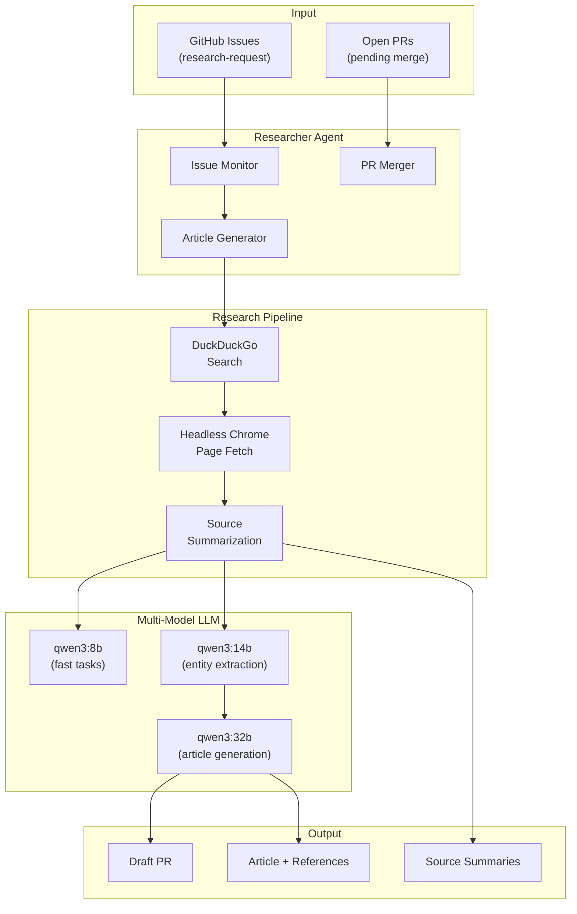
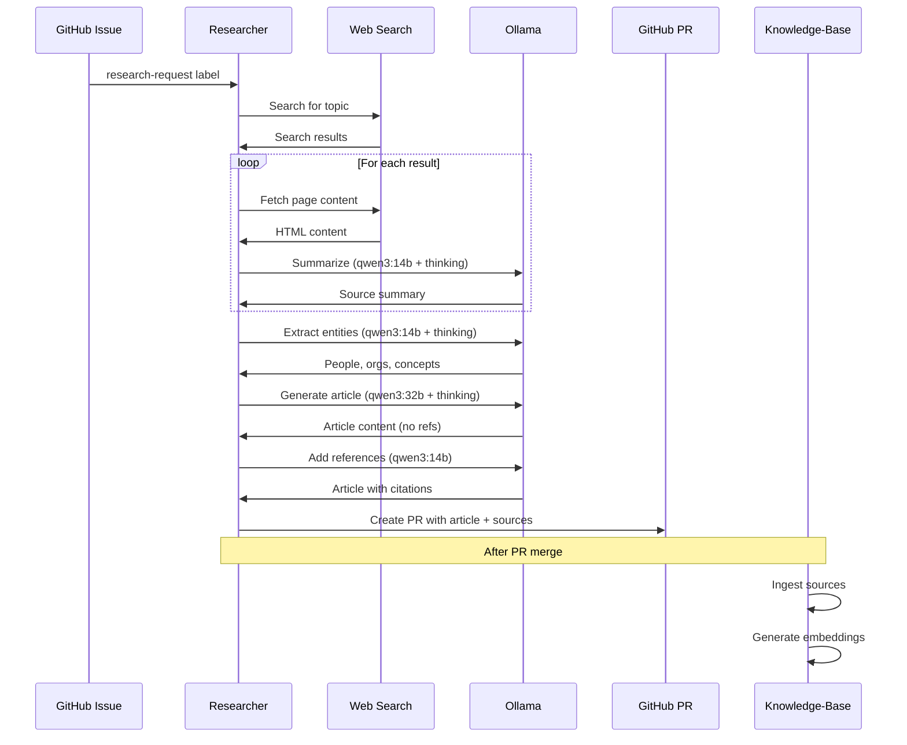

# Gitopedia Researcher

The Researcher is an AI-powered agent that automatically creates encyclopedia articles for Gitopedia. It monitors GitHub issues for research requests, gathers information from web sources, and generates well-sourced Markdown articles.

## Architecture



## Features

- **Multi-Model LLM Support**: Uses different models for different task complexities
- **Thinking Mode**: Leverages Ollama's thinking capability for better instruction following
- **Two-Step Article Generation**: Separates content creation from citation addition to prevent hallucinated references
- **Automatic PR Merging**: Resolves merge conflicts in authority files and category indexes
- **Version Tracking**: Embeds researcher version in article frontmatter
- **Debug Output**: Optional saving of thinking traces and raw sources

## Prerequisites

### GitHub CLI

```bash
# Install gh CLI (see https://cli.github.com/)
gh auth login
gh auth status
```

### Ollama

The researcher requires Ollama with the following models:

```bash
# Fast model (topic suggestion, JSON conversion)
ollama pull qwen3:8b

# Medium model (entity extraction, source summarization)
ollama pull qwen3:14b

# Large model (article generation)
ollama pull qwen3:32b

# Embedding model (for knowledge-base integration)
ollama pull nomic-embed-text
```

## Configuration

Configuration is loaded from `config/base.env` with optional overrides in `.env`.

### Key Settings

```bash
# Multi-model configuration
LLM_MODEL_FAST=qwen3:8b      # Fast tasks
LLM_MODEL_ENTITY=qwen3:14b   # Entity extraction
LLM_MODEL_ARTICLE=qwen3:32b  # Article generation

# LLM Thinking Mode (improves instruction following)
LLM_THINK_MODE=true

# Research settings
PHASE1_TARGET_SOURCES=20     # Sources to gather per topic
MAX_TOPICS_PER_RUN=10        # Topics to process per run

# Knowledge-base integration (optional)
USE_KNOWLEDGE_BASE=false
KB_API_URL=http://localhost:8081
```

See `config/base.env` for all available options.

## Running

### Docker Compose (Recommended)

```bash
cd researcher/infra
docker compose up -d

# View logs
docker compose logs -f researcher
```

### Direct Execution

```bash
cd researcher

# Normal mode (continuous loop)
go run . 

# Single run mode
go run . --once

# Merge-only mode (just merge pending PRs)
go run . --merge-only
```

## Workflow



## Article Generation

### Two-Step Process

1. **Content Generation**: The LLM generates the article without any references
2. **Citation Addition**: A separate LLM call adds footnote markers `[^N]` based only on the provided sources

This prevents hallucinated references by ensuring all citations come from actual gathered sources.

### Output Format

Articles are created with YAML frontmatter:

```yaml
---
id: 01KBCVQXJS3QK3JCRGTWBFH2A6
title: Quantum Mechanics
author: Gitopedia Researcher
summary: An overview of quantum mechanics...
tags: [physics, quantum, science]
created: 2025-12-03T04:06:38Z
model: qwen3:32b
researcher_version: 0.3.5
---

# Quantum Mechanics

Content with citations[^1] to sources[^2]...

## References

[^1]: Source title - https://example.com
[^2]: Another source - https://example.org
```

## Versioning

The researcher uses semantic versioning:

- Version stored in `VERSION` file
- Patch version auto-increments on each commit (via git hook)
- Changes documented in `CHANGELOG.md`
- Version embedded in generated articles

### Installing Git Hooks

```bash
cd researcher
./scripts/install-hooks.sh
```

## Debugging

Enable debug output to save thinking traces and raw sources:

```bash
RESEARCH_DEBUG_SOURCES=true
```

Debug files are saved to `Compendium/_debug/` in the PR branch:
- `articles/{slug}/thinking.txt` - LLM reasoning traces
- `sources/{slug}/` - Raw fetched pages and summaries

## Project Structure

```
researcher/
├── cmd/
│   └── ingest/          # Source ingestion tool
├── config/
│   └── base.env         # Default configuration
├── internal/
│   ├── agent/           # Main agent logic
│   ├── authority/       # Entity authority management
│   ├── github/          # GitHub API client
│   ├── kb/              # Knowledge-base client
│   ├── llm/             # LLM client and prompts
│   └── search/          # Web search and fetch
├── infra/
│   ├── docker-compose.yml
│   └── README.md        # Infrastructure docs
├── scripts/
│   ├── install-hooks.sh
│   └── update-version.sh
├── VERSION              # Current version
├── CHANGELOG.md         # Version history
└── main.go              # Entry point
```

## Related Documentation

- [Main Architecture](../gitopedia/docs/architecture.md)
- [Infrastructure Setup](infra/README.md)
- [LLM Prompts](internal/llm/prompts/README.md)
- [Integration Guide](../gitopedia/docs/integration.md)
