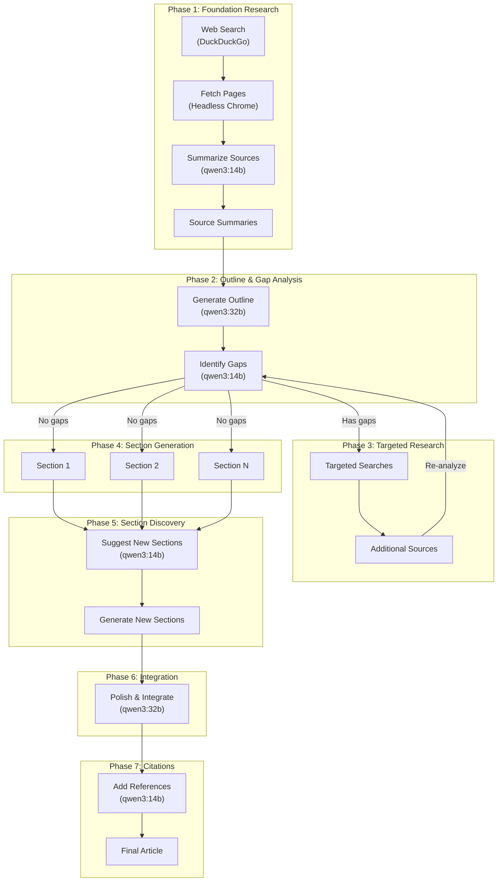
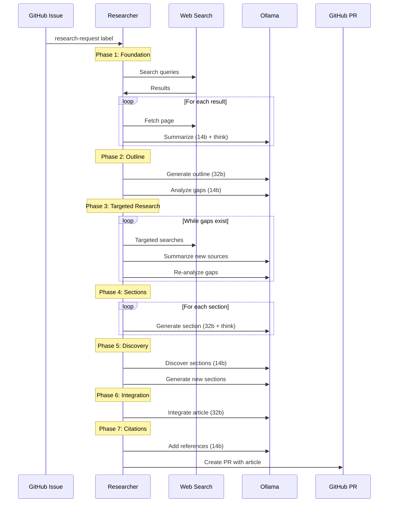

# Gitopedia Researcher

The Researcher is an AI-powered agent that automatically creates encyclopedia articles for Gitopedia using a **multi-phase generation pipeline**. It monitors GitHub issues for research requests, gathers information from web sources, and generates well-sourced, comprehensive Markdown articles.

## Multi-Phase Architecture

The researcher builds articles iteratively through 7 phases, allowing for deeper research and higher quality output:



## Phase Details

### Phase 1: Foundation Research
- Executes multiple search queries for topic variety
- Fetches page content via headless Chrome
- Summarizes sources using LLM with thinking mode
- Filters for relevance and minimum word count
- Saves source summaries to `_incoming/sources/`

### Phase 2: Outline & Gap Analysis
- Generates structured article outline from sources
- Identifies gaps in research coverage
- Suggests additional sections needed

### Phase 3: Targeted Research (Iterative)
- Performs focused searches to fill identified gaps
- Adds new sources to the knowledge base
- Re-analyzes gaps after each round
- Configurable max rounds (default: 2)

### Phase 4: Section Generation
- Generates each section individually
- Uses RAG to select relevant sources per section
- Maintains coherence with already-written sections

### Phase 5: Section Discovery
- Analyzes sources for missed topics
- Suggests additional sections to add
- Generates content for discovered sections

### Phase 6: Integration & Polish
- Merges all sections into cohesive article
- Improves transitions and flow
- Ensures consistent style and tone

### Phase 7: Citation Addition
- Adds footnote markers `[^N]` to article
- Uses only provided sources (prevents hallucination)
- Appends References section

## Multi-Model Configuration

Different models are used for different task complexities:

| Task | Model | Thinking Mode |
|------|-------|---------------|
| Topic Suggestion | qwen3:8b | No |
| Source Summarization | qwen3:14b | Yes |
| Entity Extraction | qwen3:14b | Yes |
| Outline Generation | qwen3:32b | No |
| Gap Analysis | qwen3:14b | No |
| Section Generation | qwen3:32b | Yes |
| Section Discovery | qwen3:14b | No |
| Article Integration | qwen3:32b | No |
| Reference Addition | qwen3:14b | No |

## Prerequisites

### GitHub CLI

```bash
gh auth login
gh auth status
```

### Ollama

```bash
# Fast model
ollama pull qwen3:8b

# Medium model
ollama pull qwen3:14b

# Large model
ollama pull qwen3:32b

# Embedding model (for knowledge-base)
ollama pull nomic-embed-text
```

## Configuration

Configuration is loaded from `config/base.env` with optional overrides in `.env`.

### Key Settings

```bash
# Multi-model configuration
LLM_MODEL_FAST=qwen3:8b      # Fast tasks
LLM_MODEL_ENTITY=qwen3:14b   # Entity extraction
LLM_MODEL_ARTICLE=qwen3:32b  # Article generation

# LLM Thinking Mode
LLM_THINK_MODE=true

# Research settings
PHASE1_TARGET_SOURCES=20     # Initial sources to gather
MAX_RESEARCH_ROUNDS=2        # Gap-filling iterations
SOURCES_PER_SECTION=8        # Sources per section (RAG)

# Knowledge-base integration (optional)
USE_KNOWLEDGE_BASE=false
KB_API_URL=http://localhost:8081
```

## Running

### Docker Compose (Recommended)

```bash
cd researcher/infra
docker compose up -d

# View logs
docker compose logs -f researcher
```

### Direct Execution

```bash
cd researcher

# Normal mode (continuous loop)
go run . 

# Single run mode
go run . --once

# Merge-only mode (just merge pending PRs)
go run . --merge-only
```

## Workflow Sequence



## Output Format

Articles are created with YAML frontmatter:

```yaml
---
id: 01KBCVQXJS3QK3JCRGTWBFH2A6
title: Quantum Mechanics
author: Gitopedia Researcher
summary: A comprehensive overview of quantum mechanics...
tags: [physics, quantum, science]
created: 2025-12-03T04:06:38Z
researcher_version: 0.3.6
---

# Quantum Mechanics

Content with citations[^1] to sources[^2]...

## References

[^1]: Source title - https://example.com
[^2]: Another source - https://example.org
```

## Versioning

The researcher uses semantic versioning:

- Version stored in `VERSION` file
- Patch version auto-increments on commit (via git hook)
- Changes documented in `CHANGELOG.md`
- Version embedded in generated articles

### Installing Git Hooks

```bash
cd researcher
./scripts/install-hooks.sh
```

## Debugging

Enable debug output to save thinking traces and intermediate outputs:

```bash
RESEARCH_DEBUG_SOURCES=true
```

Debug files are saved to `Compendium/_debug/` in the PR branch:
- `articles/{slug}/outline.json` - Generated outline
- `articles/{slug}/thinking.txt` - LLM reasoning traces
- `sources/{slug}/` - Raw fetched pages and summaries

## Project Structure

```
researcher/
├── cmd/
│   └── ingest/          # Source ingestion tool
├── config/
│   └── base.env         # Default configuration
├── internal/
│   ├── agent/
│   │   ├── agent.go     # Main agent logic
│   │   └── phases.go    # Multi-phase generation
│   ├── authority/       # Entity authority management
│   ├── github/          # GitHub API client
│   ├── kb/              # Knowledge-base client
│   ├── llm/             # LLM client and prompts
│   └── search/          # Web search and fetch
├── infra/
│   ├── docker-compose.yml
│   └── README.md        # Infrastructure docs
├── scripts/
│   ├── install-hooks.sh
│   └── update-version.sh
├── VERSION              # Current version
├── CHANGELOG.md         # Version history
└── main.go              # Entry point
```

## Related Documentation

- [Main Architecture](../gitopedia/docs/architecture.md)
- [Infrastructure Setup](infra/README.md)
- [LLM Prompts](internal/llm/prompts/README.md)
- [Integration Guide](../gitopedia/docs/integration.md)
