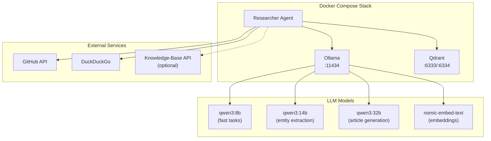

# Self-Hosted Infrastructure for Researcher

This directory contains the Docker Compose setup to run the Researcher agent with its required services.

## Architecture



## Services

| Service | Port | Purpose |
|---------|------|---------|
| **Ollama** | 11434 | LLM inference server |
| **Qdrant** | 6333 (REST), 6334 (gRPC) | Vector database for embeddings |
| **Researcher** | - | Agent container with headless Chrome |

## Quick Start

### 1. Configure Environment

Create a `.env` file with your overrides:

```bash
cat > ../.env <<EOF
GITHUB_TOKEN=your_github_token
# Or use GitHub App authentication:
# GITHUB_APP_ID=123456
# GITHUB_APP_PRIVATE_KEY_PATH=/path/to/key.pem
EOF
```

### 2. Start the Stack

```bash
cd researcher/infra
docker compose up -d
```

### 3. Pull Required Models

```bash
# Fast model (topic suggestion, JSON conversion)
docker exec -it ollama ollama pull qwen3:8b

# Medium model (entity extraction, source summarization)
docker exec -it ollama ollama pull qwen3:14b

# Large model (article generation)
docker exec -it ollama ollama pull qwen3:32b

# Embedding model (for knowledge-base integration)
docker exec -it ollama ollama pull nomic-embed-text
```

### 4. View Logs

```bash
docker compose logs -f researcher
```

## Configuration

### Multi-Model Setup

The researcher uses different models for different tasks:

```bash
# config/base.env
LLM_MODEL_FAST=qwen3:8b      # Fast tasks (topic suggestion)
LLM_MODEL_ENTITY=qwen3:14b   # Entity extraction, summarization
LLM_MODEL_ARTICLE=qwen3:32b  # Article generation
```

### Thinking Mode

Enable Ollama's thinking capability for better instruction following:

```bash
LLM_THINK_MODE=true
```

Thinking traces help the model reason through complex instructions before responding.

### Knowledge-Base Integration

To enable semantic search via the knowledge-base:

```bash
USE_KNOWLEDGE_BASE=true
KB_API_URL=http://localhost:8081
```

## Context Size Configuration

Ollama's default context size is 4096 tokens. The docker-compose.yml sets this higher:

```yaml
environment:
  - OLLAMA_NUM_CTX=${OLLAMA_NUM_CTX:-40960}
```

**Model context limits:**
| Model | Max Context |
|-------|-------------|
| qwen3:8b | 32,768 |
| qwen3:14b | 40,960 |
| qwen3:32b | 40,960 |
| gemma3:12b | 131,072 |

### Adjusting Context Size

```bash
# Option 1: Environment variable
export OLLAMA_NUM_CTX=65536
docker compose up -d

# Option 2: Edit docker-compose.yml
environment:
  - OLLAMA_NUM_CTX=65536
```

## Model Keep-Alive

Control how long models stay loaded in memory:

```yaml
environment:
  - OLLAMA_KEEP_ALIVE=${OLLAMA_KEEP_ALIVE:-30s}
```

| Value | Behavior |
|-------|----------|
| `"0"` | Unload immediately after request |
| `"30s"` | Unload after 30 seconds (default) |
| `"5m"` | Unload after 5 minutes |
| `"-1"` | Keep loaded indefinitely |

## GPU Support

### Prerequisites

1. **NVIDIA Drivers**
   ```bash
   # Ubuntu/Debian
   sudo apt install nvidia-driver nvidia-utils
   
   # Arch Linux
   sudo pacman -S nvidia nvidia-utils
   ```

2. **NVIDIA Container Toolkit**
   ```bash
   # Ubuntu/Debian
   curl -s -L https://nvidia.github.io/nvidia-docker/gpgkey | sudo apt-key add -
   distribution=$(. /etc/os-release;echo $ID$VERSION_ID)
   curl -s -L https://nvidia.github.io/nvidia-docker/$distribution/nvidia-docker.list | \
     sudo tee /etc/apt/sources.list.d/nvidia-docker.list
   sudo apt update && sudo apt install -y nvidia-container-toolkit
   sudo systemctl restart docker
   
   # Arch Linux
   yay -S nvidia-container-toolkit
   sudo systemctl restart docker
   ```

3. **Configure Docker**
   ```bash
   sudo nvidia-ctk runtime configure --runtime=docker
   sudo systemctl restart docker
   ```

### Verify GPU Access

```bash
# Test GPU in Docker
docker run --rm --gpus all nvidia/cuda:12.0.0-base-ubuntu22.04 nvidia-smi

# Check Ollama GPU usage
docker exec ollama ollama ps
```

### Disable GPU

To run on CPU only, comment out the `deploy` section in `docker-compose.yml`:

```yaml
# deploy:
#   resources:
#     reservations:
#       devices:
#         - driver: nvidia
#           count: all
#           capabilities: [gpu]
```

## Qdrant Configuration

Qdrant is used for vector similarity search:

```yaml
qdrant:
  image: qdrant/qdrant:latest
  ports:
    - "6333:6333"  # REST API
    - "6334:6334"  # gRPC
  volumes:
    - qdrant_data:/qdrant/storage
```

### Collections

The knowledge-base creates two collections:
- `sources`: Source document embeddings (768d)
- `articles`: Article embeddings (768d)

### Persistence

Data is stored in the `qdrant_data` volume. To reset:

```bash
docker compose down -v  # Removes volumes
docker compose up -d
```

## Docker Compose Reference

```yaml
services:
  ollama:
    image: ollama/ollama:latest
    container_name: ollama
    ports:
      - "11434:11434"
    volumes:
      - ollama_data:/root/.ollama
    environment:
      - OLLAMA_NUM_CTX=${OLLAMA_NUM_CTX:-40960}
      - OLLAMA_KEEP_ALIVE=${OLLAMA_KEEP_ALIVE:-30s}
    deploy:
      resources:
        reservations:
          devices:
            - driver: nvidia
              count: all
              capabilities: [gpu]

  qdrant:
    image: qdrant/qdrant:latest
    container_name: qdrant
    ports:
      - "6333:6333"
      - "6334:6334"
    volumes:
      - qdrant_data:/qdrant/storage

  researcher:
    build:
      context: ..
      dockerfile: infra/Dockerfile
    container_name: researcher
    depends_on:
      - ollama
      - qdrant
    env_file:
      - ../config/base.env
      - ../.env
    volumes:
      - ~/.config/gh:/root/.config/gh:ro  # GitHub CLI auth

volumes:
  ollama_data:
  qdrant_data:
```

## Troubleshooting

### Ollama Not Responding

```bash
# Check if running
docker ps | grep ollama

# View logs
docker logs ollama

# Restart
docker compose restart ollama
```

### Out of Memory

Reduce context size or use smaller models:

```bash
export OLLAMA_NUM_CTX=16384
docker compose up -d ollama
```

### GPU Not Detected

```bash
# Verify NVIDIA drivers
nvidia-smi

# Verify container toolkit
docker run --rm --gpus all nvidia/cuda:12.0.0-base-ubuntu22.04 nvidia-smi

# Check Ollama GPU usage
docker exec ollama ollama ps
```

### Qdrant Connection Failed

```bash
# Check if running
docker ps | grep qdrant

# Test REST API
curl http://localhost:6333/collections

# View logs
docker logs qdrant
```

## Related Documentation

- [Researcher README](../README.md)
- [Configuration](../config/base.env)
- [Main Architecture](../../gitopedia/docs/architecture.md)
